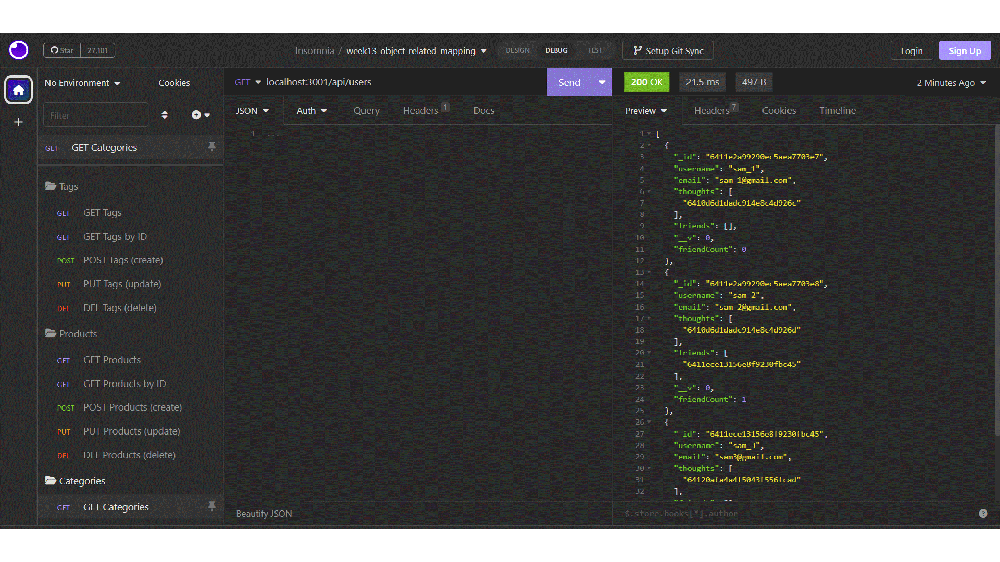

# NoSQL_Social_Network_API
  

## 1. Table of Contents:
This readme file includes the following contents:
+ [Description](#2-description)
+ [Installation](#3-installation)
+ [Usage](#4-usage)
+ [License](#5-license)
+ [Application results](#6-application-results)
+ [Questions](#7-questions)

## 2. Description: 
MongoDB is a popular choice for many social networks due to its speed with large amounts of data and flexibility with unstructured data.

This project is to build an API for a social network web application where users can share their thoughts, react to friends' thoughts, and create a friend list. So, this project utilized `Express.js` for routing, a `MongoDB` database, and the `Mongoose` ODM. 

## 3. Installation:
Please make sure to have following programs installed on your computer to use this app:
+ VS Code
+ GitBash
+ Node.js
+ MongoDB

To use this program, `git clone` the repo down to your local. Then, run `npm install` in order to install the `npm` package dependencies as specified in the `./package.json` - `Express.js`, and `Mongoose` will be installed. Now, you are ready to go!

## 4. Usage:
To use this application, follow the instruction below: 
+ First, run `npm install` on your terminal, then it will install the required `npm` packages.
+ Second, run the application: 
  + `npm run start`: This will run the application. 
  + Note: initial seed data will be included. 
+ Third, try each `routes`, which defined in `./routes`, on the `Insomnia` to see the results, e.g.,:
  + `localhost:3001/api/users`: 
  + `localhost:3001/api/users/:userId`: 
  + `localhost:3001/api/users/:userId/friends/:friendId`: 
  + `localhost:3001/api/thoughts`: 
  + `localhost:3001/api/thoughts/:thoughtId`: 

This project has the following directory structure:
+ ./assets: 
  + project workthrough video & supporting materials
+ ./config: 
  + this will allow you to connect to the `MongoDb` database
+ ./controllers: 
  + these javascript files will create (or define) each route's behavior linking with `/routes`. 
+ ./models: 
  + these javascript files will create `Mongoose` documents in `NoSQL_Social_Network`
+ ./routes: 
  + these javascript files will create (or define) each route's behavior linking with `./controllers`.
+ ./utils: 
  + `date_format` function to set custom time
+ ./LICENSE: 
  + MIT License 
+ ./package.json: 
  + specifics of npm's package.json handling
+ ./server.js: 
  + main node.js program Javascript file
+ ./README.md: 
  + readme file

## 5. License:
### The MIT License
  

## 6. Application results:
[GitHub:] https://github.com/jungwoo33/NoSQL_Social_Network_API 
View walk through video here `./assets/Presentation2.gif` -  

## 7. Questions?:
If you have any questions, feel free to contact me via information below: 
[GitHub:] https://github.com/jungwoo33 
[Email:] jungwoo33@gmail.com

- - -
© 2023 Jungwoo Lee. Confidential and Proprietary. All Rights Reserved.